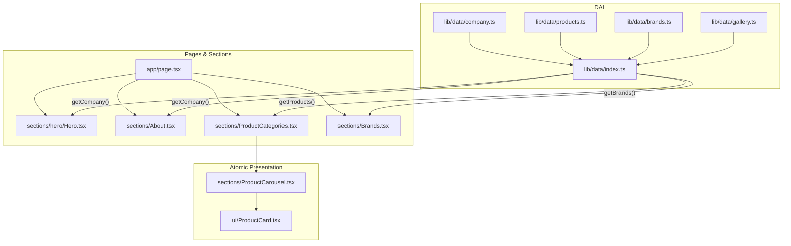
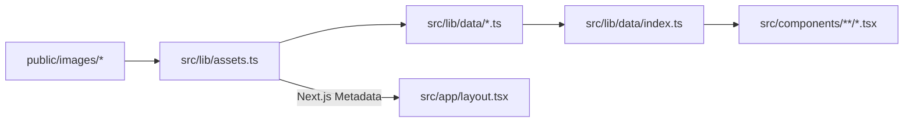

# Origin Seafoods — Corporate Website Architecture

This document describes the design philosophy, folder responsibilities, and data/asset propagation architectures for the Origin Seafoods web platform.

---

## 1. Architecture Philosophy
Our architecture is built on three core pillars:
1.  **Centralization of Assets & Data:** Dynamic items, labels, copy text, images, and brand identifiers are fully isolated from presentation markup. React components are simple, pure presentation blocks.
2.  **Strict Type Contracts:** Every domain entity has a dedicated TypeScript schema. Using strict interfaces prevents compilation drift and runtime rendering issues.
3.  **Headless-Ready Data Access Layer (DAL):** Component rendering elements never access local raw files directly. Instead, they consume data through getter methods. This creates a clean boundary allowing us to transition from local JSON/static files to live headless CMS queries without modifying a single UI component's JSX layout.

---

## 2. Folder Structure & Responsibilities

```text
src/
├── app/                  # Next.js App Router (Layouts, Routing, Page Templates)
├── components/           # Reusable UI presentation layer
│   ├── layout/           # Global components (Navbar, Footer)
│   ├── sections/         # Feature layouts (About, Brands, Contact, Gallery, etc.)
│   └── ui/               # Standard UI components (Button, Container, Card, etc.)
├── lib/                  # Shared helper logic and core configurations
│   ├── data/             # Central Data Access Layer (DAL) & static mockups
│   │   ├── index.ts      # Main DAL getter exports (getProducts, getBrands, etc.)
│   │   └── *.ts          # Domain-level mock data definitions
│   └── assets.ts         # Central Asset Registry for static image paths
└── types/                # Domain-level strict TypeScript definitions
    ├── index.ts          # Barrel export registry
    └── *.ts              # Domain interfaces (company, product, brand, etc.)
```

---

## 3. Data Flow Model

All data propagates from a single point of truth in `src/lib/data/` down to UI presentation cards:



---

## 4. Asset Propagation Flow

To prevent broken image links and unoptimized sizing, all static files must follow a centralized mapping:



*   **Rule:** Components never hardcode raw string paths (e.g. `"/images/..."`) inside `Image` elements. They must consume images by reference from the central asset registry.

---

## 5. Headless CMS Integration Roadmap (Future)

Our DAL abstraction enables a zero-downtime, drop-in replacement of mockup data when the corporate database or CMS goes live in future Sprints:

### Step 1: Mockup Phase (Current)
```typescript
// src/lib/data/index.ts
import { products } from "./products";

export function getProducts() {
  return products; // Returns static array
}
```

### Step 2: Live CMS Transition (Future)
```typescript
// src/lib/data/index.ts
import { cmsClient } from "@/lib/cms-client";
import type { Product } from "@/types";

export async function getProducts(): Promise<Product[]> {
  // Fetch live payload from headless API
  const response = await cmsClient.fetch("*[_type == 'product']");
  return response.map(cmsItem => ({
    thai: cmsItem.title_th,
    english: cmsItem.title_en,
    image: {
      src: cmsItem.image_url,
      alt: cmsItem.alt_text,
      title: cmsItem.title_en
    }
  }));
}
```

*   **Benefit:** Because components import and invoke `getProducts()` dynamically, we can swap static files for async CMS queries without touching any visual/styling code in our component libraries.
