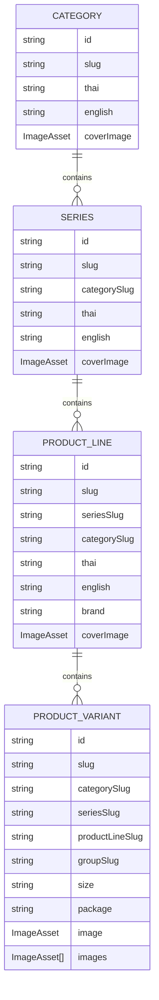
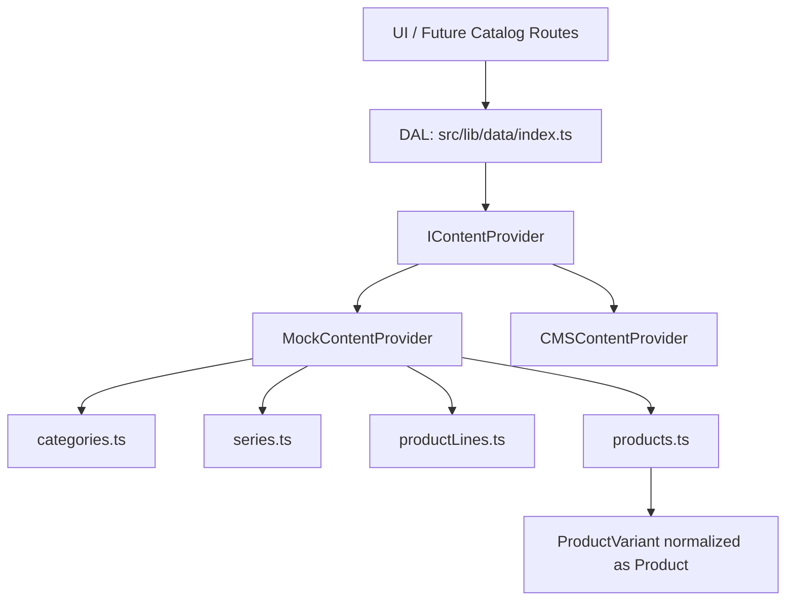

# Sprint 8.1 Walkthrough - Catalog Domain Refactor

## Objective

Prepare the catalog domain for the long-term hierarchy:

Homepage -> Category -> Series -> Product Line -> Variant -> Product Detail

This sprint changes the data model and provider/DAL foundation only. It does not redesign or modify the completed homepage sections.

## Updated Domain Model

- `Category`: top-level catalog family, such as Crabs, Squid, Shellfish, Fish, Jellyfish, and Silkworm.
- `Series`: product species or commercial family inside a category, such as Blue Swimming Crab or Argentine Squid.
- `ProductLine`: independent sellable line inside a series, such as IBNR, White Box, Green Box, or Blue Box.
- `ProductVariant`: SKU/size/specification level inside a product line, such as 60-80 M, 200UP M, or 5-6 cm.

`Product` remains an alias of `ProductVariant` so existing UI and product detail components continue to work.

## Entity Relationship Diagram



## Updated Folder Structure

```text
src/
  types/
    category.ts
    series.ts
    productLine.ts
    product.ts
    index.ts
  lib/
    data/
      categories.ts
      series.ts
      productLines.ts
      products.ts
      index.ts
    providers/
      interfaces/
        IContentProvider.ts
      mock/
        MockContentProvider.ts
      cms/
        CMSContentProvider.ts
```

## Data Flow Diagram



## Provider API Added

- `getSeries()`
- `getProductLines()`
- `getProductLinesBySeries(categorySlug, seriesSlug)`
- `getProductLineBySlug(categorySlug, seriesSlug, productLineSlug)`

Legacy provider methods remain available for current routes:

- `getProductSeriesByCategory()`
- `getProductSeriesBySlug()`
- `getProductGroupsBySeries()`
- `getProductGroupBySlug()`
- `getProductVariantsByGroup()`
- `getProductVariantBySlug()`

## Migration Notes For Sprint 8.2

- Rename route segment naming from `[group]` to `[productLine]` when ready.
- Update URL helpers to prefer `productLineSlug` over `groupSlug`.
- Replace UI labels "Product Group" with "Product Line".
- Migrate product detail pages from `getProductGroupBySlug()` to `getProductLineBySlug()`.
- Once routes are migrated, deprecate `ProductGroup` and `groupSlug`.
- Keep `groupSlug` temporarily as a compatibility alias until all product URLs and cards use `productLineSlug`.

## Implementation Summary

- Added new domain type files: `series.ts` and `productLine.ts`.
- Updated `product.ts` so `Product` continues to represent a variant while supporting `productLineSlug`, `package`, and `images`.
- Added normalized data files: `src/lib/data/series.ts` and `src/lib/data/productLines.ts`.
- Added provider/DAL methods for the new domain names.
- Preserved the current UI, routes, and responsive behavior.
- Did not move images and continued to use the existing asset registry.
